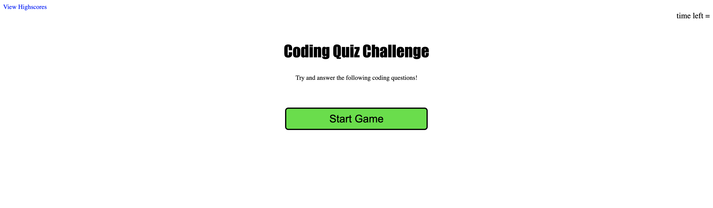

# my-coding-quiz

## Description

This mini-game is designed to test and reinforce my JavaScript coding skills.  It is a simple quiz game where the player answers multiple choice questions about coding.  Over the course of the project, I reinforced my knowledge of everything we have covered about JavaScript so far and combined that with my HTML and CSS knowldge to create a polished final product.  I learned new methods and especially learned how to get my project started with pseudocoding.

## Usage

From the starting page there is a large green "start game" button.  When you click the button, the game begins and the header containing the game name will change to a random coding question and a 75 second timer will start.  The instructional text will also dissapear and you will be presented with four multiple choice questions.  If you pick the right answer you score a point, otherwise you lose 15 seconds from the timer.  In either case, the game will proceed to the next question.  After you have answered five questions or the timer hits zero, the game will end.  At this point you will have the options to submit your initials to save your score, which you can view by clicking the "View Highscores" button.  YOu can also start the game again by clicking the big green "play again" button.

Below is a screenshot of what the game looks like at the start:

 

## Credits

Shoutout to my tutor Juno Nguyen from the UofTor coding bootcamp tutoring program.  He examined my code, helped me to simplify where I had overcomplicated things and answered all the questions I had.  This was a big help to help me get my functions to work the way I was intending.  Big thanks.

## License

Please refer to the LICENSE